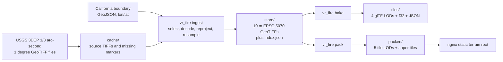
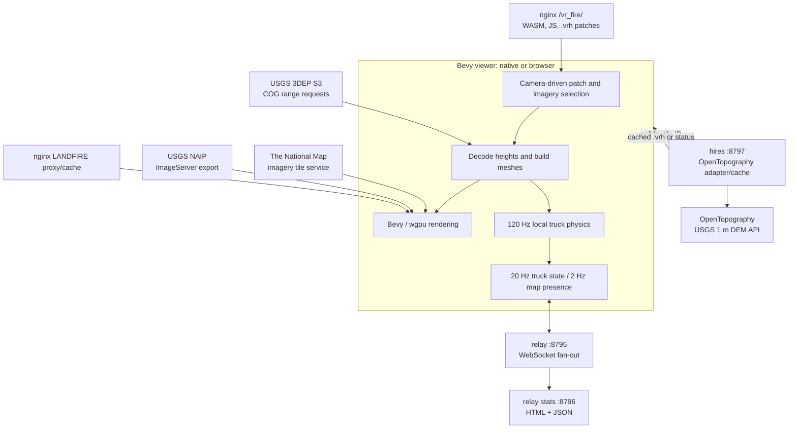
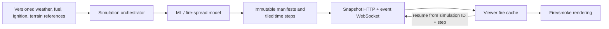

# vr_fire system architecture, data pipeline, and VR readiness

**Snapshot:** 2026-09-25, repository revision `3b525e671c2771dc69444144b548cc317fa3fd6a`, plus the uncommitted local dinosaur/lasso work described below.

This document describes the system that exists in this repository, the data it consumes and produces, the deployed network topology, the work that is still missing for a wildfire simulator, and the practical cost of turning the viewer into VR—especially a standalone Meta Quest 2 application.

Statements are classified as:

- **Implemented:** confirmed in source.
- **Validated:** exercised in this checkout on the snapshot date.
- **Deployed:** observed through a public read-only endpoint on the snapshot date.
- **Proposed:** an architecture or data contract that does not exist yet.

## 1. Executive summary

`vr_fire` currently has a strong terrain foundation and a working networked 3D demonstration, but it is not yet a wildfire simulator and it is not yet a VR application.

What exists today:

- A pure-Rust terrain ingestion pipeline that downloads USGS 3DEP 1/3 arc-second elevation GeoTIFFs, reprojects them to an EPSG:5070 grid aligned with NLCD/LANDFIRE, and writes a tiled 10 m elevation store.
- Offline exporters for glTF meshes, raw height arrays, tile metadata, and compact `.vrh` terrain patches.
- A Bevy 0.19 viewer that runs natively or as WebAssembly, streams terrain and imagery, renders California at multiple levels of detail, and provides a custom monster-truck simulation.
- A bounded multiplayer WebSocket relay, public aggregate statistics, and an on-demand high-resolution lidar service.
- A locally implemented but uncommitted dinosaur/lasso mode whose unit tests pass.

What does not exist today:

- No fire-spread model, fire-state dataset, fire/smoke renderer, ignition workflow, weather input, model orchestration, or model-to-client protocol.
- No OpenXR or WebXR session, stereoscopic camera, tracked head/controllers, haptics, VR UI, comfort system, Android package, or Quest build.
- No server-side rendered video stream, despite the original terrain design document describing that as the eventual architecture.
- No authoritative multiplayer simulation; each client owns its truck and the relay mainly forwards client-provided state.

The most important architectural decision is therefore not “how do we enable a VR flag?” It is which VR product to build:

1. **PC-rendered OpenXR viewed through Quest Link/Air Link** — fastest route to a genuine VR proof.
2. **Standalone native Quest APK using Android + OpenXR + Vulkan** — best final standalone experience, but the highest rendering and platform-integration cost.
3. **Quest Browser WebXR** — easiest distribution model, but Bevy has no first-party WebXR integration and the browser adds another performance layer.
4. **Server-rendered stereoscopic streaming** — follows the original design intent but adds a low-latency cloud-rendering product, not merely a viewer port.

The recommended sequence is PC OpenXR first, then standalone Quest only after the viewer has a strict mobile rendering profile and measured frame/memory budgets.

## 2. System context

### 2.1 Offline production pipeline



### 2.2 Runtime topology



The current runtime is **client-rendered**. Terrain decoding, mesh generation, imagery mosaics, custom physics, and gameplay all run in the browser or native viewer process. The server hosts static assets and two small services; it does not render frames.

## 3. Repository components

| Path | Responsibility | Runtime |
|---|---|---|
| `src/` | Shared grid, CRS, GeoTIFF, resampling, mesh, codec, ingest, bake, and pack library | Offline tools; selected modules are also linked into the viewer/services |
| `src/main.rs` | `vr_fire ingest`, `bake`, `pack`, and `locate` CLI | Offline |
| `viewer/` | Bevy terrain viewer, imagery, truck, multiplayer client, minimap, and local gameplay | Native desktop and browser WASM |
| `relay/` | Synchronous WebSocket relay, queue limits, transport deadlines, activity log, and stats | Server |
| `hires/` | OpenTopography adapter that creates cached 3.75 m `.vrh` patches from USGS 1 m lidar | Server |
| `compress-lab/` | Terrain compression benchmark used to select the `.vrh` codec | Offline experiment |
| `data/regions/` | Checked-in ingest boundaries | Offline and embedded in viewer |
| `cache/` | Downloaded source GeoTIFFs and missing-cell markers; ignored by Git | Local derived data |
| `store/` | Authoritative normalized 10 m terrain store and index; ignored by Git | Local derived data |
| `packed/` | Web-viewer `.vrh` output; ignored by Git | Local/deployed derived data |
| `tiles/` | Baked GLBs, raw heights, and metadata; ignored by Git | Local interchange output |
| `viewer/deploy/` | nginx locations and systemd units | Deployment configuration |
| `scripts/deploy_viewer.sh` | Builds WASM and static Linux services, uploads them, and restarts services | Deployment automation |
| `docs/review/` | Pinned 2026-09-25 code review and reproducible defect probes | Documentation/validation |
| `docs/superpowers/specs/` | Historical design records for terrain, relay, leaderboard, and dinosaurs | Documentation |

There is no database. Persistent state is held in GeoTIFF, JSON, JSONL, `.vrh`, GLB, image, and marker files.

## 4. Coordinate model and spatial invariants

The grid is the contract that joins terrain, imagery placement, future ML output, gameplay, and networking.

| Property | Value |
|---|---|
| Working CRS | EPSG:5070, NAD83 / CONUS Albers |
| Grid origin | `(-2,493,045, 3,310,005)` metres, the NW origin used by NLCD/LANDFIRE |
| Grid tile | 3,750 m × 3,750 m |
| Tile direction | `tx` increases east; `ty` increases south |
| Store sampling | 376 × 376 nodes at 10 m; neighboring tiles share their edge nodes |
| ML cell alignment | 125 × 125 cells at 30 m per tile; every third 10 m node is a cell corner |
| Intended ML window count | 10 × 10 windows per tile at 375 m |
| Viewer/world axes | +X east, +Y elevation, +Z south |
| Elevation | Metres, NAVD88 for 3DEP-derived products |
| Runtime precision | Absolute position in f64 EPSG:5070; render/physics positions in f32 relative to a movable origin |

Tile bounds are derived from the grid origin:

```text
x_min = origin_x + 3750 * tx
y_max = origin_y - 3750 * ty
x_max = x_min + 3750
y_min = y_max - 3750
```

The viewer places a tile relative to the current floating origin:

```text
world_x = albers_x - origin_x
world_z = origin_y - albers_y
world_y = elevation
```

This f64-to-relative-f32 boundary is essential. Raw California EPSG:5070 coordinates are on the order of millions of metres and would lose wheel/ground precision if stored directly as f32 scene coordinates.

### Unresolved grid contract

The original ML description uses both 30 m cells and 375 m windows. `375 / 30 = 12.5`, so a 375 m window cannot contain an integer number of 30 m cells. The terrain code currently anchors ten 375 m windows to each 3,750 m tile while independently preserving the 125-cell grid. Before integrating fire predictions, the ML team must choose one authoritative window rule—for example 360 m/12 cells, 390 m/13 cells, alternating half-cell boundaries, or an explicit resampling contract.

## 5. Data source catalog

### 5.1 Elevation and geographic boundaries

| Source | Use | Format / structure | Access | Local handling | Important caveats |
|---|---|---|---|---|---|
| Checked-in California boundary | Select tiles and super tiles covering California | GeoJSON `FeatureCollection` containing one `MultiPolygon`, lon/lat coordinates | `data/regions/california.geojson` | Parsed by `Region`; holes use an even/odd rule; a probe lattice plus boundary vertices selects tiles | The repository records `NAME=California` but does not record the boundary's upstream source, version, date, license, or checksum. That provenance should be added. |
| [USGS 3DEP 1/3 arc-second current product](https://prd-tnm.s3.amazonaws.com/StagedProducts/Elevation/13/TIFF/current/) | Primary approximately 10 m terrain | One cloud-optimized GeoTIFF per 1° cell, named from its NW corner, normally f32 elevations with internal overviews and tiled blocks | Public HTTPS/S3; no key | Offline ingest downloads whole files; viewer can instead issue HTTP byte-range requests | `current` is a moving source. The index stores source cell names but not object ETag, checksum, retrieval date, or product revision. Reproducible rebuilds therefore are not guaranteed. |
| [OpenTopography USGS DEM API](https://portal.opentopography.org/apidocs/) | Optional on-demand high-resolution terrain | GeoTIFF response for a requested lon/lat bbox, normally a UTM CRS | Server API key | `hires` downloads one response, reprojects to the project grid at 3.75 m, fills gaps, encodes `.vrh`, and caches success or `.none` | Quota, upstream availability, large temporary allocations, and incomplete coverage apply. The current daily quota is not restart-safe. |

The 3DEP source cell `n39w121`, for example, covers latitude `[38, 39)` and longitude `[-121, -120)`, and maps to `USGS_13_n39w121.tif`.

### 5.2 Imagery and land cover

| Source | Use | Runtime request | Transformation | Caveats |
|---|---|---|---|---|
| [The National Map USGS ImageryOnly tile service](https://basemap.nationalmap.gov/arcgis/rest/services/USGSImageryOnly/MapServer) | Statewide and distance-dependent aerial imagery | Public 256 × 256 JPEG Web Mercator tiles | Tiles are stitched without resampling into CPU-built mosaics; terrain vertex lon/lat becomes UV | The client depends on this third-party service and CORS at runtime. Failed tiles become a neutral fill and currently have no robust retry policy. |
| [USGS NAIP ImageServer](https://imagery.nationalmap.gov/arcgis/rest/services/USGSNAIPImagery/ImageServer) | Sharp imagery around the truck | `exportImage` for a 1.6 km EPSG:5070 square, 2,560 × 2,560 JPEG | Decoded to RGBA, mipmapped on CPU, recentered after 400 m, faded over the outer 120 m | Large decode/upload and texture-memory event; retry is every 10 seconds after failure. |
| [LANDFIRE LF2025 FBFM40](https://lfps.usgs.gov/arcgis/rest/services/Landfire_LF2025/LF2025_FBFM40_CONUS/ImageServer) | Choose near-ground texture class; intended future fire fuel layer | `exportImage` for the same 1.6 km square, 54 × 54 cells at about 30 m | Codes map to grass, shrub, timber, rock, urban, or no-detail layers | Browser requests go through a same-origin nginx proxy because direct browser requests were unreliable. FBFM40 is currently visual classification only; no fire behavior consumes it. |
| Five embedded [Poly Haven](https://polyhaven.com/) textures | Near-ground visual detail | Embedded 512 × 512 JPEGs | Decoded into a five-layer RGBA texture array with mips and normalized luminance | JPEGs are compact on disk but become uncompressed GPU textures. Asset source URLs and original checksums are not recorded per file. |

### 5.3 Gameplay and service data

| Data | Origin | Persistence | Authority |
|---|---|---|---|
| Truck pose, velocity, boost, map presence | Each viewer client | None beyond aggregate activity events | Client-authoritative; relay overwrites only `id` |
| Player name | Random `trucker-NNNN` generated by client clock seed | JSONL event history and in-memory unique-name set | Client supplied, sanitized for stats output |
| Dinosaur herds | Deterministic hash of 1 km EPSG:5070 cells | None | Local client only; not networked |
| Hires tile status | `hires` memory plus cached `.vrh`/`.none` files | Files survive restart; running jobs and quota counters do not | Hires service |
| Relay activity | Relay observations | Append-only JSONL plus last 60 events in memory | Relay |
| Fire state | **No source exists** | None | Not implemented |

## 6. Offline ingestion and transformation

### 6.1 Tile selection

1. Parse a GeoJSON `FeatureCollection`, `Feature`, `Polygon`, or `MultiPolygon` in lon/lat.
2. Compute its lon/lat bounding box and project that box to EPSG:5070.
3. Enumerate candidate 3,750 m grid tiles.
4. Test a 5 × 5 lon/lat probe lattice in each tile and include tiles containing any region vertex. This catches most boundary slivers and islands without requiring polygon clipping.
5. Optionally intersect the result with a CLI tile range such as `101,351..103,353`.

### 6.2 Source discovery and download

For every selected grid tile, the pipeline computes a padded lon/lat extent and lists all 1° 3DEP cells that can contribute samples.

The downloader:

- Uses up to four download threads by default.
- Retries up to five times with an increasing delay.
- Writes interrupted downloads to `*.tif.part` and resumes with `Range: bytes=N-`.
- Treats HTTP 404 as authoritative absence and persists an empty `*.missing` marker.
- Parses the TIFF header and first directory as a cheap cache integrity check.
- Deletes and re-downloads an unreadable cached TIFF once during ingest.
- Uses a 60-second connect/header timeout and a 30-minute response-body timeout by default.

### 6.3 GeoTIFF decoding

`Raster` normalizes a TIFF into:

```text
width, height
Vec<f32> data in row-major order
origin_x, origin_y
positive pixel_w, pixel_h
EPSG code
optional nodata value
```

Supported source CRS values are EPSG:4269 (NAD83 geographic) and EPSG:4326 (WGS84 geographic). The code includes a lenient decoder for real 3DEP LZW blocks that omit the formal end-of-information code but still produce the complete expected output.

### 6.4 Reprojection and resampling

For every 10 m destination node:

1. Compute its EPSG:5070 coordinate from the fixed grid.
2. Inverse-project to lon/lat with `proj4rs`.
3. Select the source raster by the 1° cell containing that exact coordinate. This makes shared tile edges sample the same source.
4. Bilinearly sample the source pixel grid. Nodata neighbors are dropped and the remaining weights are renormalized.
5. If no source contributes a value, write `0.0 m` and increment `filled_samples`.

If every node is missing, the tile is recorded as `empty` and no store TIFF is written. Otherwise, a 376 × 376 f32 EPSG:5070 PixelIsPoint GeoTIFF is written with Deflate compression.

### 6.5 Work grouping and memory

Ingest groups destination tiles by their primary 1° source cell, decodes required source rasters in parallel, and evicts decoded rasters not needed by the next group. `--max-loaded-sources` defaults to nine. A typical decoded 3DEP source is about 470 MB, so peak resident source data can be approximately 4.2 GiB. This offline default is not suitable for a Quest process; only derived streamed patches belong on the headset.

### 6.6 Resume and failure semantics

- `ok` plus an existing TIFF is skipped unless `--force` is used.
- `empty` is skipped on a rerun.
- `failed` is retried on a rerun.
- Each group updates `store/index.json` through temporary-file-plus-rename.
- A source download/decode failure marks only dependent destination tiles failed; it does not abort the whole state ingest.

## 7. Data formats and schemas

### 7.1 Source and store formats

| Path or object | Format | Shape | Meaning |
|---|---|---:|---|
| `data/regions/california.geojson` | GeoJSON | One `FeatureCollection` / `MultiPolygon` | Ingest and viewer coverage boundary |
| `cache/USGS_13_nNNwWWW.tif` | Source GeoTIFF/COG | Usually about 10,812² at full resolution plus overviews | Geographic 3DEP elevations |
| `cache/*.tif.part` | Partial HTTP body | Bytes | Resumable download state |
| `cache/*.missing` | Empty marker file | 0 bytes | Remembered source 404 |
| `store/{tx}_{ty}.tif` | Deflate GeoTIFF, f32, PixelIsPoint, EPSG:5070 | 376² | Normalized 10 m heights; north row first |
| `store/index.json` | Pretty JSON | Map keyed by `tx_ty` | Grid origin, status, elevation range, filled count, source cell names |

Conceptual `index.json` entry:

```json
{
  "grid": { "origin_x": -2493045.0, "origin_y": 3310005.0 },
  "tiles": {
    "102_352": {
      "status": "ok",
      "min_elevation_m": 492.23,
      "max_elevation_m": 885.89,
      "filled_samples": 0,
      "sources": ["n39w121"]
    }
  }
}
```

### 7.2 Baked interchange outputs

`vr_fire bake` reads the normalized store and produces:

| Output | Contents |
|---|---|
| `tiles/lod0/{tile}.glb` | 10 m mesh, 376 nodes per side |
| `tiles/lod1/{tile}.glb` | 30 m mesh, 126 nodes per side |
| `tiles/lod2/{tile}.glb` | 150 m mesh, 26 nodes per side |
| `tiles/lod3/{tile}.glb` | 750 m mesh, 6 nodes per side |
| `tiles/{tile}.f32` | 376² little-endian f32 heights, row-major, north row first |
| `tiles/{tile}.json` | Bounds, CRS, axes, datum, LOD paths, ranges, provenance, pipeline version |

GLB vertices are local to a tile's northwest corner. They contain position, normal, UV0, and triangle indices. Every edge has a 50 m downward skirt to hide gaps between neighboring LODs. Normals use 10 m source heights and reach into neighboring tiles when available.

The baked products are useful for Blender or another engine, but the current Bevy viewer does **not** load these GLBs. It builds runtime meshes from `.vrh` or COG height samples.

### 7.3 Packed viewer format (`VRH1`)

`vr_fire pack` generates one-node border rings so runtime meshes can compute seamless normals. Its tile levels are not the same four-level set emitted by `bake`.

| Path | Coverage | Interior nodes | Spacing | Quantization step | Maximum quantization error |
|---|---:|---:|---:|---:|---:|
| `packed/t0/{tile}.vrh` | 3.75 km | 376² | 10 m | 0.25 m | 0.125 m |
| `packed/t1/{tile}.vrh` | 3.75 km | 126² | 30 m | 0.25 m | 0.125 m |
| `packed/t2/{tile}.vrh` | 3.75 km | 76² | 50 m | 0.5 m | 0.25 m |
| `packed/t3/{tile}.vrh` | 3.75 km | 26² | 150 m | 0.5 m | 0.25 m |
| `packed/t4/{tile}.vrh` | 3.75 km | 16² | 250 m | 0.5 m | 0.25 m |
| `packed/s/{sx}_{sy}.vrh` | 37.5 km | 51² | 750 m | 1.0 m | 0.5 m |
| Hires cache `{tile}.vrh` | 3.75 km | 1001² | 3.75 m | 0.1 m | 0.05 m |

The stored side is `interior side + 2` because of the border ring. All multibyte values are little-endian.

```text
offset  size  field
0       4     ASCII "VRH1"
4       2     side: u16
6       4     quantization step in metres: f32
10      4     minimum quantized value: i32
14      1     wide flag: 0 = u16 residuals, 1 = u32 residuals
15      ...   Brotli stream, quality 11, of byte-shuffled zigzag residuals
```

Encoding rounds each height to `height / step`, subtracts a common base, applies the two-dimensional Lorenzo predictor `west + north - northwest`, zigzag-encodes signed residuals, byte-shuffles them, and Brotli-compresses the result.

The codec is compact and fast on valid data, but the current decoder trusts dimensions and decompressed size too late; see F06 below.

### 7.4 Nodata representation

The ingest store does not preserve a per-sample validity mask. Missing samples become `0.0 m`, and only a tile-level `filled_samples` count survives. During pack, every zero in a tile with any filled samples is treated as missing and changed to `-300 m`. That confuses legitimate sea-level terrain with missing data and is the root of F03. A future schema must preserve explicit sample validity.

## 8. Runtime terrain and rendering pipeline

### 8.1 Patch selection

The viewer maintains roughly a few hundred 37.5 km super tiles over California. Every 0.2 seconds it computes the camera's distance to each patch:

- Beyond 62.5 km, render the 750 m super tile.
- Within 62.5 km, replace a super tile with its 100 child grid tiles only after every child has a renderable fallback.
- Select the finest grid level whose node spacing is at least `0.004 × view distance`.
- Prefer a requested 3.75 m hires tile within 15 km.
- Keep the old/coarser patch visible until the replacement is complete.
- Despawn built regular patches that are no longer wanted. Built hires patches are retained for the session.

This avoids holes and large LOD pops but can retain requested hires data indefinitely.

### 8.2 Height acquisition

The default source is compressed `.vrh`:

1. Request a relative static path such as `tiles/t0/102_352.vrh`, with at most 16 packed requests in flight.
2. Decode the patch if HTTP 200 and the side matches the expected LOD.
3. If the file is missing, corrupt, or otherwise unsuccessful, fall back to direct COG sampling.

COG fallback:

1. Request the first 64 KiB of each required 3DEP file.
2. Parse dimensions, tiled-block offsets/counts, pixel scale/tiepoint, and overview levels.
3. Choose an overview near the desired node spacing.
4. Request only required compressed TIFF blocks by HTTP range, with at most 12 in flight.
5. Decode each sparse block and bilinearly sample the ringed patch grid.

The source can be toggled between compressed-first and COG-only with `C`. The current COG cache has no byte-budgeted eviction and transient errors become permanent missing entries for the session.

### 8.3 Runtime mesh creation

Terrain jobs move through `Fetch -> Plan -> Wait -> Build` stages. Work is checked against a 4 ms per-frame CPU budget, but some individual operations—including COG block decode and a full hires mesh build—are not preemptible and can exceed that budget.

For each patch the viewer:

- Projects a coarse 25-node lattice to lon/lat and interpolates the remaining coordinates.
- Computes central-difference normals from the border ring.
- Builds a triangle grid and a dynamic skirt whose depth scales from 20 to 800 m.
- Assigns UV0 for the statewide atlas and UV1 for the current detail mosaic.
- Stores the interior CPU height field so picking and truck wheel raycasts use the exact same triangle split as rendering.

### 8.4 Imagery

The rendering layers are:

1. A zoom-8 statewide Web Mercator atlas so every terrain patch has immediate imagery.
2. Distance-dependent mosaics at zoom 12, 14, 15, or 16.
3. A 2,560² near-truck NAIP image exported directly in EPSG:5070.
4. A shader modulation layer selected by approximately 30 m LANDFIRE fuel codes.

JPEGs are decoded to RGBA and mipmapped on the CPU. Detail JPEG tile decode/stitching has a 2.5 ms frame budget. Mosaics unused for 20 seconds are released, and source JPEG bytes are retained only while a live mosaic needs them.

### 8.5 Scene and gameplay

- One perspective camera switches between map orbit and chase modes.
- One directional light uses three shadow cascades normally and one in the WebGL2 build.
- MSAA is 4× normally and 2× in the WebGL2 build.
- A large water plane is fixed at `-150 m`; missing terrain is `-300 m`.
- Truck physics is custom, client-local, and fixed at 120 Hz. It uses four suspension raycasts, a friction-circle tire model, body contacts, air control, boost, and interpolated rendering.
- Remote trucks are dead-reckoned for at most 0.25 seconds and smoothed toward their last reported state.

The local uncommitted dinosaur work adds deterministic herds, five species, local AI, procedural multi-part models, and a lasso/hog-tie mechanic. It caps living dinosaurs at 40 and runs high-level behavior at 5 Hz. It is not synchronized through the relay.

## 9. Client/server networking

### 9.1 HTTP flows

| Client request | Destination | Response | Cache/retry behavior |
|---|---|---|---|
| App HTML/JS/WASM | `GET /vr_fire/` | Static browser application | nginx serves precompressed WASM with `Content-Encoding: gzip`; current config says `no-cache` |
| Packed terrain | `GET /vr_fire/tiles/{t0..t4|s}/...vrh` | Binary `VRH1` patch or missing status | Viewer falls back to COG; static deployment overlays files and does not remove obsolete paths |
| COG header/block | Direct USGS S3 range GET | Partial GeoTIFF bytes | Failure is terminal for that cell/block during the current viewer session |
| Aerial imagery | Direct The National Map tile GET | JPEG tile | Missing tile becomes neutral fill; no strong retry state |
| Near imagery | Direct NAIP `exportImage` GET | 2,560² JPEG | Retry after 10 seconds |
| Fuel classification | `GET /vr_fire/fuel?...` | LANDFIRE image export through nginx | nginx cache: 512 MB max, 30-day 200-response validity, 60-day inactivity |
| Hires request/poll | `GET /vr_fire/hires/{tx}_{ty}.vrh` | 200 bytes, 202 working, 404 no coverage, 429 quota, or 503 busy | Viewer polls working/busy states; successful/no-data results are cached server-side |
| Public stats | `GET /vr_fire/stats` or `.json` | HTML or JSON | `no-store` |

The client never sends terrain, imagery, or fire data to the server. Its only routine upload is small WebSocket JSON for presence/gameplay.

### 9.2 WebSocket protocol

Endpoint: `wss://chilos.dev/vr_fire/ws` in production. Native builds can override it with `VR_FIRE_RELAY`.

Messages use tagged JSON with field `t`:

```json
{ "t": "welcome", "id": 7 }
```

```json
{
  "t": "s",
  "id": 7,
  "name": "trucker-1234",
  "x": -2108650.5,
  "y": 1988112.0,
  "h": 642.5,
  "q": [0.0, 0.2, 0.0, 0.98],
  "v": [3.0, 0.0, -8.0],
  "b": false,
  "m": false
}
```

- `x`, `y`: absolute EPSG:5070 metres.
- `h`: elevation/world Y in metres.
- `q`: quaternion `[x, y, z, w]`.
- `v`: world-frame velocity in m/s.
- `b`: boosting.
- `m`: optional map-presence flag; omitted when false.
- The client sends truck state at 20 Hz or map presence at 2 Hz.
- The relay ignores the supplied `id` and inserts the server-assigned one.

Other messages:

```json
{ "t": "ping", "c": 123456.7 }
{ "t": "over", "id": 7, "by": "trucker-4321" }
{ "t": "leave", "id": 7 }
```

`ping` is echoed only to its sender. `over` is rebroadcast to everyone including its sender. Poses go only to other peers. `leave` is generated by relay cleanup.

### 9.3 Relay bounds and failure isolation

The relay now enforces:

| Limit | Value |
|---|---:|
| Admitted sockets, including handshakes/closing workers | 32 |
| Per-recipient outbox | 64 entries |
| Maximum assembled message | 4,096 bytes |
| Maximum WebSocket frame | 4,096 bytes |
| Tungstenite write buffer | 16 KiB |
| Kernel send buffer | 64 KiB |
| Complete write deadline | 500 ms |
| Absolute handshake deadline | 5 s |
| Incoming message rate | 40/s with burst 40 |
| Idle timeout | 60 s |
| Outbound drain slice | 32 messages or 2 ms |

Pending poses from the same sender replace one another in a recipient's queue. Control events remain FIFO. A recipient that cannot accept a nonreplaceable message is closed without blocking healthy peers. The viewer reconnects after five seconds.

### 9.4 Authority, privacy, and integrity

- The relay is a fan-out service, not a game server. It does not validate plausible positions, quaternions, velocity, boost, collision, or game-over claims.
- There is no account, authentication, room selection, encryption inside the application protocol, or replay protection. TLS is terminated by nginx.
- Public stats round locations to 0.01° (roughly 1 km), do not intentionally store IP addresses, and sanitize/escape names.
- The JSONL log grows without a retention policy, and the in-memory set of historical names grows for the process lifetime.
- Fire or emergency-training use would require a separate trust model. Client-provided state must never be treated as authoritative model evidence.

## 10. Hires service

The hires service accepts only California-like numeric tile IDs and allows one heavy job at a time.

For an uncached tile it:

1. Converts the EPSG:5070 tile bounds to a padded lon/lat bbox.
2. Requests `datasetName=USGS1m`, `outputFormat=GTiff` from OpenTopography using a server-only API key.
3. Caps the HTTP response body at 1 GiB and writes a temporary TIFF.
4. Reads the response's UTM EPSG code and supports NAD83, NAD83(2011), and WGS84 UTM zones.
5. Reprojects each ringed 3.75 m destination node through lon/lat into source UTM and bilinearly samples it.
6. Iteratively fills NaN gaps from valid four-neighbors.
7. Rejects coverage below 50% as no lidar.
8. Encodes at a 0.1 m quantization step and atomically renames the final `.vrh`.

The systemd unit gives this service a 700 MB memory limit, but the source notes that work can require 1–2 GB. That mismatch has not been load-tested in this review and could terminate the service on a large response.

## 11. Deployment architecture

### 11.1 Build and publish

`scripts/deploy_viewer.sh`:

1. Builds WebGPU and WebGL2 WASM variants.
2. Runs `wasm-bindgen` for both.
3. gzip-compresses the WASM and uploads only the `.gz` payload.
4. Cross-compiles `relay` and `hires` as static musl binaries.
5. Uploads static files and replacement binaries over SSH/SCP.
6. Renames the service binaries and restarts both systemd units.
7. Optionally overlays the full `packed/` tree when `UPLOAD_TILES=1`.

The deployment is not transactional as a whole. Static files can be from different build moments during upload, service restarts are coupled, and packed terrain is overlaid rather than version-switched.

### 11.2 Production process layout

| Process/location | Responsibility | Resource policy |
|---|---|---|
| nginx `/vr_fire/` | Static JS/WASM and terrain patches | gzip static; current config sets `no-cache` broadly |
| nginx `/vr_fire/ws` | TLS/WebSocket reverse proxy to relay `127.0.0.1:8795` | One-hour proxy timeouts |
| nginx `/vr_fire/stats` | Proxy to relay stats `127.0.0.1:8796` | Public |
| nginx `/vr_fire/hires/` | Proxy to hires `127.0.0.1:8797` | 60-second read timeout |
| nginx `/vr_fire/fuel` | LANDFIRE proxy/cache | GET only; strips cookies; 512 MB cache |
| `vr-fire-relay.service` | Multiplayer and stats | restart always; 64 MB memory limit |
| `vr-fire-hires.service` | Lidar adapter/cache | restart always; 700 MB memory limit; key in mode-600 environment file |

On 2026-09-25, read-only public checks confirmed:

- `/vr_fire/` returned the WebGPU/WebGL2 loader.
- `/vr_fire/stats.json` returned the bounded relay's additive `relay` counters and 32/64 limits.
- A known packed tile returned HTTP 200 with a 49,446-byte body.
- The WebGPU WASM endpoint was served with gzip and a roughly 13.1 MB transfer size.

There is no build/revision endpoint, so these observations do not prove that every deployed byte matches this checkout.

## 12. Current state

### 12.1 Local data products

Observed in this checkout:

| Directory | Size | Contents |
|---|---:|---|
| `cache/` | 24 GiB | 72 downloaded 3DEP TIFFs |
| `store/` | 13 GiB | 30,826 indexed tiles, all currently `ok` |
| `packed/` | 2.0 GiB | 147,578 `.vrh` files: 29,467 at each of five grid LODs plus 243 super tiles |
| `tiles/` | 82 MiB | Nine baked Placerville-area tiles, each with four GLBs, one f32 file, and one JSON file |

There are fewer packed grid tiles than successful store tiles because a packed patch requires its complete border-neighbor ring. Missing coastal/boundary neighbors cause pack to skip the patch and make the viewer use COG fallback.

These directories are ignored by Git. They are outputs in this checkout, not portable source artifacts.

### 12.2 Feature status matrix

| Capability | Status | Evidence / limitation |
|---|---|---|
| California terrain ingest | Implemented and locally materialized | 30,826 successful store tiles |
| Resumable source cache | Implemented and validated | Unit/local HTTP fixture tests pass |
| GLB bake | Implemented; partially materialized | Nine local tiles, not statewide |
| Compressed terrain pack | Implemented and statewide locally | 147,578 files, about 2 GiB |
| Native viewer | Implemented | Unit tested; no fresh interactive acceptance in this documentation pass |
| Browser WebGPU viewer | Implemented and publicly reachable | Public loader/WASM endpoint responds; prior docs report Chrome testing |
| Browser WebGL2 fallback | Built/deployed path exists | No recorded physical-browser acceptance |
| Terrain/imagery streaming | Implemented | No browser-memory soak; known cache/retry defects remain |
| Truck physics | Implemented | Unit-level terrain/physics support; interactive behavior documented |
| Multiplayer relay | Implemented, validated, and deployment presence verified | 37 relay tests pass; prior 10-minute local soak; no fresh production load test |
| Hires lidar | Implemented | Unit tests pass; no paid/live OpenTopography request in this pass |
| Public stats | Implemented and deployed | Public JSON endpoint responds |
| Dinosaur/lasso mode | Implemented only in uncommitted local files | 30 dinosaur-related viewer tests pass; not part of `HEAD` |
| Leaderboards | Design only | No `courses.rs` or leaderboard implementation |
| Wildfire model/data/rendering | Not implemented | Only grid alignment and a fuel visualization input exist |
| VR/XR | Not implemented | No OpenXR/WebXR/Android XR code or headset test |

### 12.3 Automated validation on this snapshot

The following passed locally:

- 66 core library tests.
- 8 ingest/pipeline integration tests.
- 43 viewer tests, including the uncommitted dinosaur/lasso tests.
- 33 relay unit tests and 4 loopback integration tests.
- 3 hires tests.

Total: **157 passed, 1 intentionally ignored external 3DEP download test**.

The tests do not start a final renderer, verify shaders on Quest, measure frame time, perform browser acceptance, exercise live OpenTopography, or prove a current deployed revision.

Warnings remain for the non-kebab-case `vr_fire` binary, an unused imagery field, and a future-incompatible Rust trait-recursion warning generated by Bevy's `AsBindGroup` derive.

### 12.4 Documentation drift

Several historical documents are now stale:

- The root README still says relay F01 implementation is pending even though the bounded implementation, tests, local soak record, and public counters exist.
- The relay design header still says implementation is pending; its completion record later in the same file is newer.
- The dinosaur design says nothing is implemented, while the current worktree contains a complete uncommitted implementation.
- Viewer download-size documentation reflects an earlier build and does not identify an exact revision.

This document records those differences without rewriting the historical design/review snapshots.

## 13. Problems encountered and remaining defects

The pinned code review identified nine concrete findings. F01 has since been implemented; F02–F09 remain present in the current source.

| ID | State | Problem | Impact | Required fix |
|---|---|---|---|---|
| F01 | Implemented and locally load-validated | Slow relay peers previously had unbounded outbound queues | Relay-wide memory growth/restart | Bounded outboxes, coalescing, deadlines, limits, and isolation now exist. A fresh through-nginx production-equivalent soak is still useful. |
| F02 | Open | Decoded COG tiles remain for the whole viewer session | Browser/Quest memory grows as the user explores | Add a byte-budgeted LRU, pin only active dependencies, and prune stale queued work. |
| F03 | Open | Any `0.0 m` in a partly filled tile is packed as `-300 m` | Valid sea-level terrain becomes a 300 m depression | Preserve a per-sample validity mask/nodata value; version and rebuild the store. |
| F04 | Open | A transient COG HTTP/decode failure becomes terminal for the session | Temporary network errors flatten land to ocean | Track absence separately from retryable failure; use bounded exponential backoff while retaining coarse terrain. |
| F05 | Open | Switching compressed/COG sources can strand a hires tile in `Building` | Tile cannot complete or be requested again | Preserve hires build jobs or atomically reset state to retryable. |
| F06 | Open | `.vrh` dimensions, step, arithmetic, and decompression output are insufficiently bounded | Corrupt/untrusted static or hires bytes can allocate excessively or produce NaN heights | Validate expected dimensions/step first, cap decompression exactly, use checked arithmetic, reject non-finite output. |
| F07 | Open | Repacking and deployment leave old files in place | A stale successful tile can be served after current data becomes failed/empty | Build a versioned manifest, validate it, publish atomically, and switch a version pointer. |
| F08 | Open | Store read validates origin but not pixel spacing/full extent | A substituted 20 m TIFF can be treated as 10 m terrain | Validate finite positive 10 m spacing and complete expected bounds. |
| F09 | Open | OpenTopography daily count is process-memory only | Restarting `hires` resets the supposed daily cap | Persist UTC day plus reserved calls atomically before upstream requests. |

Additional unresolved concerns:

- **No boundary provenance:** the California GeoJSON cannot currently be audited or reproduced from a named upstream release.
- **Moving source alias:** ingest uses 3DEP's `current` path without recording ETag/checksum/retrieval date.
- **Main-thread spikes:** COG decode, hires mesh creation, large JPEG decode/mips, and GPU uploads are not all bounded below a VR frame budget.
- **Large initial application:** current deployed WebGPU WASM transfers about 13.1 MB compressed; local pre-bindgen WASM with active work is about 85–86 MiB raw.
- **Third-party runtime dependency:** terrain fallback and all imagery require external government services unless data is mirrored.
- **Hires memory policy mismatch:** source comments anticipate 1–2 GB while systemd permits 700 MB.
- **No content-addressed deployment:** there is no manifest tying app revision, packed terrain version, boundary version, and data-source snapshot together.
- **No authoritative simulation:** multiplayer accepts client motion and outcomes; a future shared fire timeline must be server/model authoritative.
- **No operational telemetry for rendering:** relay network gauges exist, but no deployed frame-time, cache-size, failed-fetch, or decoder telemetry exists.

## 14. What must be built for the wildfire simulator

Terrain alignment is only the substrate. A real simulator needs the following layers.

### 14.1 Required domain inputs

At minimum, define versioned sources and units for:

- Initial ignition geometry and time.
- Fuel model and fuel moisture.
- Wind vectors over time and altitude/height convention.
- Temperature, humidity, precipitation, and weather forecast provenance.
- Terrain slope/aspect, either derived from the store or supplied by the model pipeline.
- Fire barriers/suppression actions if they are in scope.
- Model configuration, model version, random seed, and confidence/uncertainty outputs.

LANDFIRE FBFM40 is present as a visual input, but no current code proves it is the exact dataset/version expected by the ML model.

### 14.2 Proposed fire-data contract

Use the existing EPSG:5070 tile/cell IDs as the join key. Do not send thousands of geographic polygons every frame.

A proposed immutable simulation manifest:

```json
{
  "schema": "vr-fire-sim/1",
  "simulation_id": "example-2026-09-25T18:00:00Z",
  "model": { "name": "model-name", "version": "git-or-image-digest" },
  "grid": {
    "crs": "EPSG:5070",
    "origin": [-2493045.0, 3310005.0],
    "cell_m": 30,
    "tile_cells": 125
  },
  "start_time": "2026-09-25T18:00:00Z",
  "step_seconds": 300,
  "fields": [
    { "name": "burn_state", "type": "u8", "encoding": "enum" },
    { "name": "arrival_time_s", "type": "u32", "nodata": 4294967295 },
    { "name": "intensity_kw_m", "type": "f16", "scale": 1.0 },
    { "name": "confidence", "type": "u8", "scale": 0.0039215686 }
  ]
}
```

Proposed per-tile frame payload:

```text
magic/version
simulation ID or manifest hash
time-step index
tx, ty
field bitmask
uncompressed byte count
compressed binary arrays in row-major north-first order
checksum
```

The payload should be binary and compressed, with JSON used only for manifests/control metadata. A 125 × 125 one-byte field is 15,625 bytes before compression; it maps directly to one texture texel per ML cell and directly to UV `[c/125, (c+1)/125] × [r/125, (r+1)/125]`.

Required contract decisions before implementation:

- Cell center versus cell area semantics.
- Whether timestamps represent instantaneous state, interval average, or arrival time.
- Nodata and “not simulated” distinction.
- Units and valid ranges for every field.
- Versioning/backward compatibility.
- Full snapshots versus deltas and how a client recovers after missing a delta.
- Deterministic mapping between ML windows and the 30 m grid.
- Model confidence and ensemble representation.

### 14.3 Proposed fire runtime architecture



Recommended separation:

- HTTP/object storage serves immutable manifests and tile snapshots with strong cache keys.
- A WebSocket or server-sent event channel announces new simulation steps and control state; it should not be the only source of truth.
- The client maintains a small time window of nearby fire tiles, uploads scalar fields as GPU textures, and can seek/replay by timestamp.
- Fire simulation traffic must be a separate protocol/service from the casual truck relay.
- The model service owns time and state. Clients can request ignition/scenario changes only through authenticated commands, not by publishing state directly.

### 14.4 Fire rendering work

Implement in stages:

1. Cell-colored burn-state/intensity overlay aligned to the 125² tile UV grid.
2. Time controls, legend, units, provenance, and confidence visualization.
3. Flame geometry or particles driven by cell intensity and wind.
4. Smoke with strict LOD and overdraw controls.
5. Lighting/visibility effects and optional ember transport.
6. Validation images comparing rendered cell boundaries against model arrays and known coordinates.

Smoke and translucent fire particles are especially expensive in VR because overdraw is paid across two high-resolution eye views. The first VR milestone should use an opaque/emissive terrain overlay and sparse effects, not cinematic volumetric smoke.

## 15. VR architecture options

### 15.1 Option comparison

| Route | Reuse of current viewer | Main new systems | Performance headroom | Distribution | Relative complexity |
|---|---|---|---|---|---|
| PC OpenXR + Quest Link/Air Link | High | OpenXR render integration, stereo rig, tracked input, VR UI | Highest; PC GPU/CPU | Desktop build plus Quest connection | Medium |
| Quest Browser WebXR | Medium | WebXR session/frames/input/layers bridge into Bevy/wgpu | Lowest-to-medium; browser overhead on mobile | HTTPS URL or WebXR PWA | High |
| Standalone native Quest APK | Medium-high gameplay reuse; renderer/platform work is substantial | Android lifecycle/package, OpenXR loader/session/swapchains, Vulkan integration, controls, performance profile | Mobile but direct/native | APK / Meta Horizon distribution | Very high |
| Server-rendered VR stream | Low-to-medium viewer reuse | GPU render workers, stereo encoder, signaling, pose uplink, jitter buffer, decode, reprojection, session placement | Server GPU, but latency/network constrained | Thin headset client plus backend | Extreme |

### 15.2 Recommended route

1. **Prove PC OpenXR first.** Use Quest 2 through Link/Air Link to validate scale, camera behavior, tracked controls, comfort, and the terrain/fire visual language without immediately fighting mobile GPU limits.
2. **Create an explicit mobile/XR renderer profile.** This must be useful even before Android packaging: lower shadow count/distance, compressed GPU textures, hard cache budgets, batched dinosaur models, lower terrain/imagery concurrency, and no blocking decode on the frame thread.
3. **Run a native Android + OpenXR spike.** Prove one stereo terrain patch, head tracking, controller input, and sustained 72 Hz on physical Quest 2 before committing to the full port.
4. **Port systems incrementally.** Terrain streaming, imagery, truck, multiplayer, and finally fire effects.

Bevy 0.19 can build Android applications, but Bevy still has no first-party OpenXR integration: the upstream [OpenXR issue remains open](https://github.com/bevyengine/bevy/issues/115). The community [bevy_oxr project](https://github.com/awtterpip/bevy_oxr) is an integration candidate, not a drop-in guarantee; its Bevy 0.19, Android, Quest 2, multiview, and maintenance compatibility must be proven in a throwaway branch before it becomes an architectural dependency.

## 16. Work required to make the current viewer VR

### 16.1 Rendering and session lifecycle

- Create/start/pause/resume/destroy an OpenXR or WebXR session.
- Query headset capabilities instead of assuming a device model.
- Obtain predicted display time and tracked head/eye poses each frame.
- Render into runtime-provided stereo swapchain images.
- Submit depth where supported for compositor reprojection.
- Support multiview/single-pass stereo; rendering the scene twice naively can nearly double CPU draw submission.
- Add late pose sampling/late latching if the chosen Bevy integration permits it.
- Handle lost sessions, focus changes, headset sleep, Android surface recreation, and runtime refresh-rate changes.

This is the deepest integration risk because XR owns frame pacing and swapchain images while Bevy/wgpu normally owns window presentation.

### 16.2 Camera and world scale

- Replace the single map/chase camera with an XR rig containing tracked head and two eye views.
- Preserve a consistent 1 Bevy unit = 1 metre scale.
- Move the floating-origin system at safe moments without shifting the tracked head unexpectedly.
- Separate vehicle body motion from head motion; never force headset orientation to match truck roll/pitch.
- Provide recenter and seated/standing origin choices.

### 16.3 Input and interaction

Current controls are keyboard/mouse. VR needs an action-based abstraction for:

- Trigger/grip/thumbstick/buttons on both controllers.
- Hand/controller poses.
- Haptics.
- Menu, reset/recenter, map teleport, vehicle enter/exit, throttle/brake/steering, boost, hires request, and lasso.
- A non-XR mapping retained for desktop tests.

The truck control scheme should prefer seated play: left stick steering, right trigger throttle, left trigger brake/reverse, a face button for boost, and a comfort-safe view independent of vehicle roll.

### 16.4 UI

The current HUD, minimap, labels, and game-over banner are 2D screen-space Bevy UI. In VR they need one or more of:

- Head-locked compositor/UI layer for critical status.
- Wrist/controller panel for controls and map.
- World-space labels with size/distance limits.
- Diegetic dashboard for speed/boost/network.

Small screen-space text rendered independently in each eye will be uncomfortable and hard to focus. UI must be tested at the Quest 2's optical resolution, not only in a desktop mirror window.

### 16.5 Comfort and safety

The current monster truck can boost, jump, roll, and flip. Those are high-risk VR motions. Add:

- Horizon lock or strong roll/pitch filtering for the user's camera.
- Snap-turn and smooth-turn choices.
- Optional vignette during acceleration/turning.
- Adjustable speed/boost intensity.
- Seated mode and explicit recenter.
- Instant cut/fade rather than uncontrolled camera tumbling after a crash.
- Pausing when tracking/session focus is lost.
- Comfort rating and a first-run warning/settings flow.

### 16.6 Audio and feedback

There is no current spatial audio system documented. VR should add spatialized engine, terrain, fire, dinosaur, and multiplayer cues carefully, plus haptics for boost/collision/lasso. Audio is not required for the first rendering proof but is part of a complete experience.

## 17. Meta Quest 2 port risks

Meta supports Quest 2 through OpenXR. Native development requires an Android OpenXR loader and Android-specific instance/session setup; Meta currently documents Khronos loader 1.0.34 or newer. Vulkan is the recommended graphics API for new Quest work. See Meta's [OpenXR support](https://developers.meta.com/horizon/documentation/native/android/mobile-openxr/), [instance/session setup](https://developers.meta.com/horizon/documentation/native/android/mobile-openxr-instance-session/), and [Vulkan guidance](https://developers.meta.com/horizon/documentation/unreal/os-vulkan-opengl/).

### 17.1 Performance and memory risks

| Risk | Why this project is exposed | Mitigation / acceptance gate |
|---|---|---|
| 72 Hz minimum practical target | Default 72 Hz allows only 13.9 ms for the complete frame, including two views | Physical-device p95/p99 frame timing with no repeated missed frames; never infer readiness from desktop FPS |
| Stereo fill rate | Terrain, imagery, water, detail shader, shadows, fire, and smoke touch many pixels twice | Multiview, fixed foveated rendering, reduced render scale when acceptable, simpler materials, sparse transparency |
| Draw calls | Terrain patches and procedural dinosaur body parts are separate entities; dinosaur design allows roughly 500 part entities before terrain/trucks/UI | Batch/instance dinosaur parts, merge static terrain where possible, profile actual draw calls; make dinosaurs optional on Quest 2 |
| Shadows | Current non-WebGL path uses three directional-light cascades | Quest profile: one small cascade or blob/contact shadows; measure before adding fire lighting |
| Texture memory/bandwidth | CPU RGBA imagery mosaics, a 2,560² near image with mips, detail array, fuel texture, and two eye buffers | KTX2/Basis or device-native GPU compression, strict texture budget/LRU, lower near-image size, staged uploads |
| COG memory leak | Decoded COG blocks are retained for the session | F02 is a release blocker; use a measured byte-budgeted LRU |
| Blocking CPU work | TIFF/JPEG/VRH decode, mip generation, mesh build, and asset upload can exceed a frame | Worker threads/tasks, bounded work queues, prebuilt mesh/index templates, incremental GPU uploads |
| WASM/browser overhead | Browser route adds WASM and browser runtime overhead; current transfer is already about 13 MB gzip | Treat WebXR as a separate measured target; use code splitting/feature pruning and compare against native |
| Thermal throttling | Sustained high load can reduce clocks/refresh behavior | 20–30 minute physical Quest 2 thermal soak with OVR Metrics, not a short benchmark |
| Memory ceiling | Meta documents a 4.4 GiB Quest 2 PSS limit, with less practical headroom desirable | Set a substantially lower project budget, sample PSS during exploration, and prove a plateau rather than just staying below kill level |

Meta's current reference gives 13.9 ms at 72 Hz and 11.1 ms at 90 Hz ([display refresh rates](https://developers.meta.com/horizon/documentation/native/android/mobile-display-refresh-rate/)). It documents a 4.4 GiB Quest 2 application PSS limit ([memory limits](https://developers.meta.com/horizon/essentials/memory-ram/)). Those are hard platform ceilings, not sensible target budgets; the app needs headroom for the OS, driver behavior, content growth, and peak decoding.

### 17.2 Rendering feature compatibility

- Bevy's current wgpu render path must share or import OpenXR Vulkan resources correctly.
- The selected integration must support Android ARM64, Quest's loader initialization, runtime-created swapchains, multiview, depth submission, and the Bevy version pinned here.
- The custom `ExtendedMaterial` shader must compile and bind correctly on Quest Vulkan and in stereo/multiview.
- Bevy's current future-incompatible `AsBindGroup` compiler warning should be resolved before depending on a newer toolchain for Android/XR.
- The current WebGL2 fallback does not prove Quest WebXR support. A WebXR app needs an immersive session and XR frame loop; drawing the existing canvas in Quest Browser remains a flat 2D webpage.

### 17.3 Network and offline behavior

- Quest sessions are mobile/Wi-Fi sessions. Direct requests to several external hosts increase DNS, TLS, latency, CORS, and availability risk.
- Rapid motion can outrun terrain/imagery streaming and expose ocean/coarse fallback close to the user.
- A public-sector/demo environment may block one or more external domains.
- A standalone APK does not imply offline capability; the current architecture still needs the hosted `.vrh` tree and external imagery.
- For predictable field use, mirror/pin permitted terrain and imagery, add an offline region pack, or clearly define a connected-only product.

### 17.4 Android packaging and operations

- Add an Android Gradle project, `arm64-v8a` Rust library build, signing, manifest, immersive OpenXR intent filter, supported-device metadata, and store assets.
- Select and test minimum/target Android API levels. Bevy's Android example uses `cargo-ndk` and Gradle; its default `GameActivity` path has its own API-level constraints ([Bevy Android build documentation](https://docs.rs/crate/bevy/latest/source/examples/README.md#1685-1748)).
- Configure internet access and cleartext policy for development only; production traffic should remain HTTPS/WSS.
- Add Android lifecycle logging, native crash symbols, ANR monitoring, and device-side profiling.
- Test installation/update, permission denial, sleep/wake, controller disconnect, Wi-Fi loss, low-memory kill, and thermal throttling.

### 17.5 Quest 2-specific product limitations

- It is older and materially slower than Quest 3-class hardware, so it should remain the minimum-performance device if it is supported.
- It has no color passthrough requirement relevant to this VR viewer; do not design core behavior around newer mixed-reality-only capabilities.
- Lack of eye tracking means eye-tracked foveation is unavailable; use fixed foveation if the integration exposes it.
- High-speed driving and vehicle roll create more comfort risk than a walking/teleport terrain viewer.
- Detailed smoke is likely to be fill-rate bound. Use simplified smoke impostors or omit smoke on the initial Quest 2 profile.

Meta's WebXR guidance recommends minimizing overdraw, real-time shadows, complex materials, and uncompressed texture bandwidth, and specifically recommends KTX2/Basis for texture compression ([WebXR performance guidance](https://developers.meta.com/horizon/documentation/web/webxr-perf-bp/)). Those recommendations also align with this native/mobile scene.

## 18. Complexity estimate

These are planning ranges for one experienced Rust/graphics engineer with access to a Quest 2. They are not delivery commitments and exclude completion of the actual wildfire model.

| Milestone | Added effort | Why |
|---|---:|---|
| PC OpenXR terrain proof | 2–5 engineer-weeks | Evaluate/pin XR integration, stereo render, head pose, one controller, basic VR rig |
| PC VR feature-complete viewer | Additional 4–8 weeks | Input abstraction, VR UI, comfort, map/truck transitions, multiplayer, profiling |
| Standalone Quest rendering spike | 3–6 weeks | Android package, loader/session/swapchains, Vulkan/wgpu integration, one optimized scene |
| Standalone Quest MVP after spike | Additional 8–16 weeks | Streaming, cache budgets, shaders, controls/UI, lifecycle, physical-device optimization |
| Quest production hardening | Additional 6–12 weeks | Soak, thermal/memory/crash work, store/distribution, device matrix, operational telemetry |
| WebXR route instead of native | Roughly 6–14 weeks for an MVP | Requires a WebXR bridge/frame loop and mobile web optimization; Bevy lacks first-party support |
| Server-rendered VR route | Roughly 4–8+ engineer-months plus GPU operations | Stereo cloud renderer, session scheduling, head-pose uplink, sub-frame encoding, transport, decoder client, jitter/reprojection, security, cost controls |

Relative to the current desktop/browser viewer, a credible standalone Quest product is approximately a **2–3× increase in client-platform complexity** even before wildfire simulation. If the team also adds the model pipeline, fire/smoke rendering, scenario control, and reproducibility, the whole product is closer to a new major phase than a port.

The server-rendered route can reduce headset scene/render complexity, but it replaces that work with an even larger latency-sensitive distributed system. It is justified only when the simulation/render workload cannot fit on the headset or centralized control is a core requirement.

## 19. Recommended implementation plan

### Phase 0 — Correctness and reproducibility

1. Fix F03, F06, F07, F08, and F09 before treating outputs as trustworthy or untrusted network bytes as safe.
2. Add boundary and 3DEP object provenance: source URL, retrieval time, ETag/checksum, and data version.
3. Define a versioned pack manifest and atomic deployment/version switch.
4. Resolve the 375 m/30 m ML-grid contract.
5. Add a build-info endpoint/file containing source revision, data-manifest hash, and schema versions.

### Phase 1 — Runtime stability

1. Fix F02, F04, and F05.
2. Move all potentially long decode/build work off the render-critical path.
3. Add explicit CPU height, decoded COG, JPEG, GPU texture, mesh, and hires cache budgets.
4. Add retry/error telemetry and an offline/static-source mode.
5. Run desktop and browser memory/frame-time exploration soaks.

### Phase 2 — Fire minimum vertical slice

1. Freeze a simulation manifest and tiled binary frame schema.
2. Build a fixture generator and a non-ML synthetic spread sequence.
3. Render one 125² burn-state/intensity texture exactly on one terrain tile.
4. Add timeline controls, units, provenance, and snapshot recovery.
5. Integrate the real model only after the transport/render contract is testable independently.

### Phase 3 — PC VR proof

1. Evaluate the XR integration in an isolated branch with the smallest Bevy scene.
2. Prove stereo terrain, predicted head pose, one tracked controller, 1 m world scale, and stable floating-origin behavior.
3. Add seated truck controls, horizon-safe camera, recenter, and a minimal VR status panel.
4. Validate through Quest Link/Air Link before touching the standalone build.

### Phase 4 — Quest 2 mobile profile

1. Build Android ARM64 and launch through OpenXR/Vulkan.
2. Start with 72 Hz, one shadow cascade or no dynamic shadows, no dinosaurs, no smoke, and bounded local content.
3. Add multiview/foveation and compressed GPU textures.
4. Port streaming with hard memory budgets and worker-thread decode.
5. Reintroduce features one at a time against frame, thermal, and memory gates.

### Phase 5 — Product hardening

1. Add authenticated scenario/session control separate from the casual relay.
2. Add failure-safe reconnect/snapshot recovery for fire state.
3. Validate data lineage from model input through rendered output.
4. Run physical-device comfort, accessibility, network-loss, thermal, and long-session tests.
5. Produce repeatable signed builds with exact source/data manifests.

## 20. Acceptance criteria

### 20.1 Fire vertical slice

- A known synthetic 125 × 125 field aligns with terrain cell corners and survives tile boundaries.
- Manifest/schema/unit mismatches fail loudly rather than rendering plausible-looking wrong data.
- A disconnected client can fetch a complete snapshot and resume from a later event.
- The UI always shows model version, simulation time, units, and stale/disconnected status.

### 20.2 PC VR proof

- OpenXR session survives start, focus loss, resume, and clean exit.
- Head movement is tracked at the runtime's predicted display time without visible world lag.
- Both eyes render correct terrain with no seam, culling, or material mismatch.
- Recenter and seated controls work without keyboard/mouse.
- Truck roll does not forcibly roll the user's horizon.

### 20.3 Standalone Quest 2 MVP

- Sustains 72 Hz on physical Quest 2 in representative terrain at p95 and p99, not just average FPS.
- Holds a stable memory plateau during a long cross-state exploration; cache usage is visible and bounded.
- Completes a 20–30 minute thermal soak without persistent frame-rate collapse.
- Survives Wi-Fi loss, source 404/503, headset sleep/wake, controller disconnect, and low-memory pressure with understandable user feedback.
- Uses no desktop-only environment variables or filesystem assumptions.
- Starts from a signed APK/PWA and requires no development cable.

## 21. Useful commands

```bash
# Locate the project tile/cell for a lon/lat
cargo run --release -- locate --lon -120.8 --lat 38.79

# Ingest a small tile block
cargo run --release -- ingest --tiles 101,351..103,353

# Bake interchange meshes
cargo run --release -- bake --tiles 101,351..103,353

# Pack the normalized store for the viewer
cargo run --release -- pack

# Native viewer
cargo run --release -p viewer

# Local relay plus viewer override
PORT=8795 cargo run --release -p relay
VR_FIRE_RELAY=ws://127.0.0.1:8795 cargo run --release -p viewer

# Offline automated tests; loopback fixture tests need permission to bind localhost
cargo test --offline --workspace
```

## 22. Related project documents

- `README.md` — concise terrain CLI and output overview.
- `viewer/README.md` — viewer controls and implementation overview.
- `docs/superpowers/specs/2026-09-24-terrain-pipeline-design.md` — original terrain design and assumptions.
- `docs/review/README.md` — pinned review with F01–F09 evidence and diagrams.
- `docs/superpowers/specs/2026-09-25-relay-backpressure-design.md` — relay design plus implementation/load record.
- `docs/superpowers/specs/2026-09-25-leaderboard-design.md` — proposed leaderboard, not implemented.
- `docs/superpowers/specs/2026-09-25-dinosaur-mode-design.md` — design behind the active local dinosaur work.

## 23. External platform references

- [Meta Quest OpenXR support](https://developers.meta.com/horizon/documentation/native/android/mobile-openxr/)
- [Meta Quest OpenXR instance and session setup](https://developers.meta.com/horizon/documentation/native/android/mobile-openxr-instance-session/)
- [Meta Quest Browser and WebXR overview](https://developers.meta.com/horizon/documentation/web/)
- [Meta Quest display refresh rates and frame budgets](https://developers.meta.com/horizon/documentation/native/android/mobile-display-refresh-rate/)
- [Meta Quest application memory limits](https://developers.meta.com/horizon/essentials/memory-ram/)
- [Meta Quest WebXR performance guidance](https://developers.meta.com/horizon/documentation/web/webxr-perf-bp/)
- [Bevy Android build example](https://docs.rs/crate/bevy/latest/source/examples/README.md#1685-1748)
- [Bevy first-party OpenXR tracking issue](https://github.com/bevyengine/bevy/issues/115)
- [Community Bevy OpenXR project](https://github.com/awtterpip/bevy_oxr)
