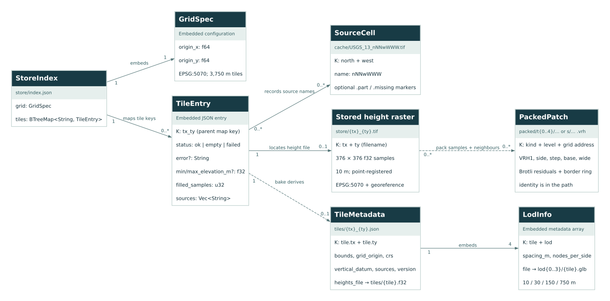
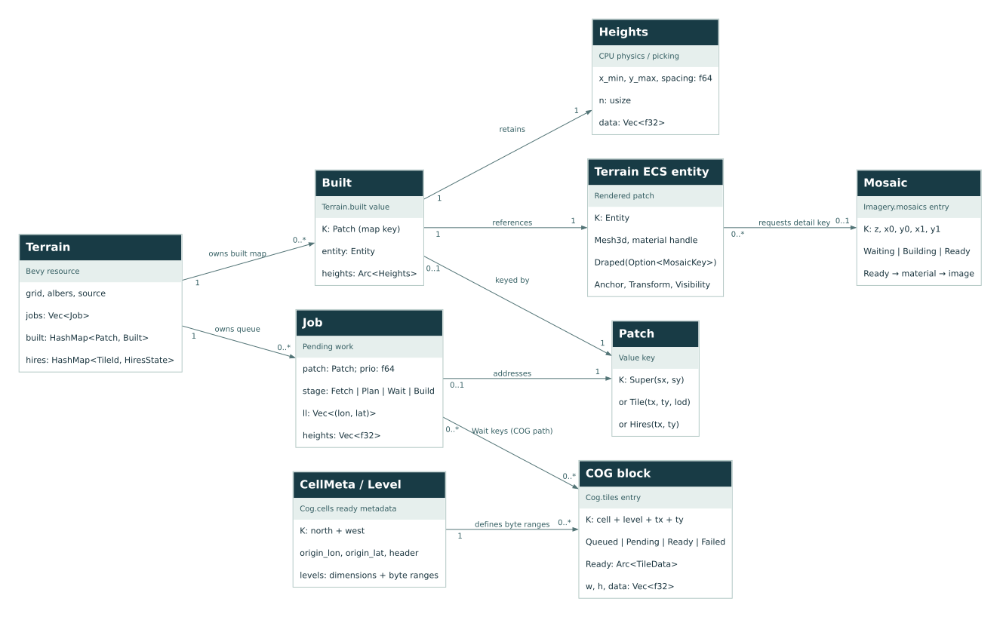
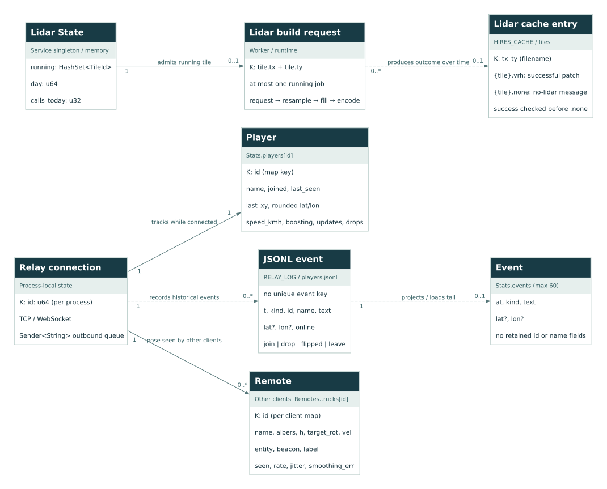

# vr_fire code review — 2026-09-25

[Open the HTML report](index.html). It works directly from disk, including diagrams, filters, source excerpts and print styling.

Revision: `c15e0beb052d4373430d1486e4065f69e49edc63`.

The pipeline has useful geometry, reprojection, codec and cache tests. The main gaps are failure recovery, bounded resource use, and preservation of terrain validity. Nine actionable findings are documented below; four have bounded, offline reproductions.

Repository-wide static review, with deeper tracing of ingest/store/pack, viewer streaming, multiplayer and the lidar service. This is a snapshot of local source and checked-in deployment configuration, not an audit of the running server. No application fixes or deployments were performed.

The review started at dddce95 with existing viewer edits. Those edits were committed concurrently as c15e0be during the review. The final source references and excerpts are pinned to c15e0be; the reviewer did not make that commit.

## Follow-ups (after this snapshot)

- **2026-09-25, F01:** fixed and deployed (bounded outboxes, write deadlines, admission cap,
  rate limit). Tests, a 12-minute 64 MiB soak and the production check are recorded in the
  [relay backpressure spec, §12](../superpowers/specs/2026-09-25-relay-backpressure-design.md#12-implementation-record-2026-09-25-local-validation-only).
  Still to run: the nginx soak and a 32-socket soak. The findings below are the original
  snapshot and are unchanged.

## Findings

| ID | Priority | Component | Evidence | Finding |
|---|---|---|---|---|
| [F01](index.html#F01) | P1 | Relay | Code-confirmed | A slow peer can grow an unbounded relay queue |
| [F02](index.html#F02) | P2 | Viewer | Code-confirmed | Decoded COG terrain is retained for the entire session |
| [F03](index.html#F03) | P2 | Pipeline | Reproduced | Packing turns valid zero-metre terrain into a 300-metre depression |
| [F04](index.html#F04) | P2 | Viewer | Code-confirmed | A transient COG failure becomes permanent missing terrain |
| [F05](index.html#F05) | P2 | Viewer | Code-confirmed | Switching terrain source can strand a lidar tile in Building |
| [F06](index.html#F06) | P2 | Codec | Reproduced | VRH headers and decompression are not bounded before decoding |
| [F07](index.html#F07) | P2 | Pipeline | Reproduced | Repacking leaves obsolete terrain files available for serving |
| [F08](index.html#F08) | P2 | Pipeline | Reproduced | Store validation accepts a raster with the wrong pixel spacing |
| [F09](index.html#F09) | P2 | Lidar | Code-confirmed | The daily OpenTopography cap resets on every process restart |

P1 = high priority; P2 = medium priority. Reproduced = synthetic local probe. Code-confirmed = source-traced cause and path, without end-to-end load or visual validation.

### F01 [P1] A slow peer can grow an unbounded relay queue

One client that stops reading can accumulate copies of other players' messages indefinitely. The checked-in relay service has a 64 MB memory cap, so queue growth can restart the service and disconnect every player.

**Trigger:** Keep one WebSocket connection open without reading while other clients continue sending state. No high-volume live test was run.

**Cause:** Each peer gets std::sync::mpsc::channel, which has no capacity limit. broadcast clones each message into every recipient queue. The peer loop performs blocking ws.send without a write timeout. A blocked reader therefore prevents its own queue from draining while producers continue enqueueing. There is also no per-client message-rate limit.

**Recommendation:** Use bounded per-peer queues, coalesce replaceable pose updates, and disconnect a peer on sustained backpressure or a write deadline. Apply message and frame size limits at the WebSocket layer, plus a modest ingress rate limit.

**Acceptance:** With a non-reading peer and a bounded stream of local state messages, queue depth and process memory stay bounded; healthy peers continue receiving updates and the stalled peer is removed.

**Source:** [relay/src/main.rs:29–50](../../relay/src/main.rs), [viewer/deploy/vr-fire-relay.service:9–15](../../viewer/deploy/vr-fire-relay.service).

### F02 [P2] Decoded COG terrain is retained for the entire session

Exploring new areas in COG mode, or in areas that fall back from packed terrain, keeps adding CPU-resident height blocks even after their meshes disappear. Long browser sessions can exhaust memory.

**Trigger:** Pan or drive through many distinct source blocks. A typical full 512 × 512 f32 block occupies 1 MiB before container overhead; 1,000 retained blocks account for about 1 GiB.

**Cause:** Cog.tiles retains every Ready(Arc<TileData>) entry. The viewer removes unwanted built patches, but there is no corresponding removal or capacity policy in the COG cache. Dropping meshes does not release the Arc still owned by Cog.tiles. The imagery cache has an eviction path; the COG cache does not.

**Recommendation:** Track source blocks needed by active jobs and nearby patches, then apply a byte-budgeted LRU to unpinned blocks. Prune stale queued work when the camera moves.

**Acceptance:** Replay a fixed route across many disjoint areas twice and verify that decoded-cache bytes plateau at the configured budget while active jobs complete correctly.

**Source:** [viewer/src/cog.rs:73–99](../../viewer/src/cog.rs), [viewer/src/cog.rs:180–193](../../viewer/src/cog.rs), [viewer/src/terrain.rs:424–440](../../viewer/src/terrain.rs).

### F03 [P2] Packing turns valid zero-metre terrain into a 300-metre depression

Valid sea-level terrain can become a deep pit in the packed viewer. Packed and raw COG modes then disagree on geometry and collision heights.

**Trigger:** Pack an OK tile containing an actual 0.0 m sample, even when filled_samples is zero.

**Cause:** Ingest represents missing samples as 0.0 and stores only a count of filled samples. Pack subsequently treats every exact zero as missing and replaces it with OCEAN_M (-300). Once the sample-level validity mask has been discarded, genuine zeros cannot be distinguished from filled ocean nodes.

**Recommendation:** Preserve a per-sample validity mask or an explicit nodata representation through ingest and store, and use that mask during packing. Existing stores need a documented migration or rebuild to recover that information.

**Acceptance:** A tile containing both a real zero and a missing sample preserves the real zero within quantization error while only the missing sample becomes OCEAN_M. Compare packed heights to the source with the same mask.

**Reproduction:** The bundled probe writes a synthetic valid all-zero tile with filled_samples=0, calls run_pack, decodes t0/1_1.vrh, and observes -300.0 m at the first interior sample.

**Source:** [src/pack.rs:44–51](../../src/pack.rs), [src/reproject.rs:49–55](../../src/reproject.rs), [src/reproject.rs:71–76](../../src/reproject.rs), [src/lod.rs:17–19](../../src/lod.rs).

### F04 [P2] A transient COG failure becomes permanent missing terrain

A temporary HTTP error, connection failure or decode error can flatten otherwise valid land to ocean for the rest of the application session. Retrying the terrain source does not clear the COG failure entries.

**Trigger:** Fail one header or block request once, then restore the connection.

**Cause:** fetch_range drops HTTP status/error distinctions and returns None for any unsuccessful response. pump records that as CellState::Missing or TileState::Failed. Subsequent cell/tile calls immediately return Some(None), with no retry path or expiry. run_jobs treats these terminal failures as completed work and samples OCEAN_M into the mesh. set_source clears terrain work but retains the separate Cog resource.

**Recommendation:** Distinguish authoritative absence from transient transport and decode failures. Add bounded retries with backoff and an explicit retry state; keep a coarser valid patch visible while retrying.

**Acceptance:** A local response sequence of 503 followed by valid range bytes recovers automatically; an actual absence has a separate state and policy. The recovered mesh matches a clean load.

**Source:** [viewer/src/cog.rs:117–125](../../viewer/src/cog.rs), [viewer/src/cog.rs:133–158](../../viewer/src/cog.rs), [viewer/src/cog.rs:170–192](../../viewer/src/cog.rs), [viewer/src/terrain.rs:631–660](../../viewer/src/terrain.rs).

### F05 [P2] Switching terrain source can strand a lidar tile in Building

A lidar request can remain marked as building indefinitely, with no mesh and no way to restart it in the current session.

**Trigger:** Press C after a successful lidar download creates a Stage::Build job but before that job is built. The frame budget permits this state to persist between frames.

**Cause:** set_source preserves already-built lidar tiles but clears all jobs, including pending Patch::Hires build jobs. The hires map still contains HiresState::Building. select_patches marks that patch wanted with f64::MAX, explicitly excludes such entries from new-job creation, and polling handles only Waiting. request_hires uses or_insert, so another request cannot reset the stuck entry.

**Recommendation:** Preserve queued lidar jobs when changing the regular terrain source, or explicitly reset affected lidar states to a requestable state. Make the job and public progress state transition together.

**Acceptance:** Queue a downloaded lidar build, switch Compressed → Cog before building, then advance jobs. The tile reaches Ready or an explicit recoverable error; requesting again must not silently do nothing.

**Source:** [viewer/src/terrain.rs:288–310](../../viewer/src/terrain.rs), [viewer/src/terrain.rs:417–421](../../viewer/src/terrain.rs), [viewer/src/terrain.rs:439–445](../../viewer/src/terrain.rs), [viewer/src/terrain.rs:555–564](../../viewer/src/terrain.rs).

### F06 [P2] VRH headers and decompression are not bounded before decoding

A malformed or corrupted patch can supply non-finite terrain heights or request excessive allocations. Viewer-side dimension checks happen only after decoding, so they do not protect the decoder.

**Trigger:** Change a valid patch's quantization step to NaN. A separate inspection-only case is a header claiming a very large side or a compressed stream expanding beyond the claimed residual length.

**Cause:** decode checks magic and header length but does not require a positive finite step, a legal width flag, or a supported side. It preallocates from side² and decompresses into an uncapped Vec, checking output length afterward. Prediction and base addition also use unchecked i32 arithmetic. The offline probe demonstrates accepted NaN output; large allocations and overflow attacks were not executed.

**Recommendation:** Validate header fields against supported dimensions and numeric ranges before allocation. Bound decompression output to the exact expected residual size, use checked arithmetic, and reject non-finite reconstructed heights. Pass expected dimensions into the decoder where possible.

**Acceptance:** Small malformed fixtures for invalid side, step, flag, arithmetic overflow and oversized decompressed output all return errors within a fixed memory budget; normal tile and lidar round trips still pass.

**Reproduction:** The bundled probe encodes four heights, replaces bytes 6..10 with f32::NAN, and confirms decode returns Ok with four NaN heights.

**Source:** [src/codec.rs:60–89](../../src/codec.rs), [viewer/src/terrain.rs:555–563](../../viewer/src/terrain.rs), [viewer/src/terrain.rs:588–601](../../viewer/src/terrain.rs).

### F07 [P2] Repacking leaves obsolete terrain files available for serving

A tile that is now failed, empty, or no longer packable can keep serving its old successful .vrh. The viewer receives HTTP 200 and never takes the intended COG fallback for that obsolete output.

**Trigger:** Pack to a directory, change an input tile's status to Failed, then pack again into the same directory. Losing a required neighbour can likewise change an emitted patch into a skipped patch.

**Cause:** run_pack enumerates only current OK tiles and increments skipped for incomplete patches. It never reconciles or removes previous output files. The optional deployment tar extraction overlays files on the server and likewise does not remove obsolete files. Individual packed files are also written directly, so an interrupted overwrite can leave a partial patch.

**Recommendation:** Build each pack into a new versioned directory with an output manifest, validate it, then atomically switch the served version. Reconcile obsolete paths using that manifest and publish individual files atomically.

**Acceptance:** After a formerly valid tile fails, repacking and publishing yields no stale successful response at its old path. Simulate an interrupted build and ensure the previously published version remains intact.

**Reproduction:** The bundled probe packs a tile, marks it Failed, runs pack again, and confirms files=0 while packed/t0/1_1.vrh still exists.

**Source:** [src/pack.rs:80–108](../../src/pack.rs), [scripts/deploy_viewer.sh:24–27](../../scripts/deploy_viewer.sh).

### F08 [P2] Store validation accepts a raster with the wrong pixel spacing

A mis-georeferenced or externally replaced store TIFF can be silently interpreted as a 10 m tile even though it spans a different extent. Baked and packed terrain will be stretched into the wrong footprint.

**Trigger:** Provide a 376 × 376 EPSG:5070 TIFF whose first pixel centre matches the expected tile corner but whose pixels are 20 m apart.

**Cause:** read_tile checks dimensions, EPSG, and the location of the first sample. It does not check pixel_w or pixel_h against NODE_SPACING_M. Because the returned value is only a Vec<f32>, downstream code loses the original spacing and assumes the fixed 10 m grid. Normal files produced by Store::write_tile use the correct spacing; this is a missing validation boundary for damaged or substituted store files.

**Recommendation:** Validate both pixel dimensions as finite, positive and equal to NODE_SPACING_M within the intended tolerance; validate the complete expected extent before returning the samples.

**Acceptance:** Matching 10 m point-registered tiles pass. The same shape and first-node position with 20 m, zero, negative or non-finite spacing is rejected with a path-specific error.

**Reproduction:** The bundled probe writes a 20 m point-registered TIFF with the expected first-node position and confirms Store::read_tile returns Some rather than an error.

**Source:** [src/store.rs:108–131](../../src/store.rs), [src/grid.rs:11–13](../../src/grid.rs).

### F09 [P2] The daily OpenTopography cap resets on every process restart

A deploy, crash, or service restart can permit another full day's configured allowance on the same UTC date. The configured cap therefore does not bound daily upstream usage.

**Trigger:** Consume part of HIRES_DAILY_CAP, restart hires, and request previously uncached tiles on the same UTC day.

**Cause:** State starts with day=0 and calls_today=0 on each launch. Counters exist only in memory, while the service is configured to restart automatically and the deployment script restarts it. Cache files avoid repeated requests for successful tiles, but they do not restore the day's total attempts, including errors and uncached requests.

**Recommendation:** Persist the UTC day and reserved request count atomically before issuing an upstream request. Restore them at startup, count failures consistently, and define behavior for an unreadable quota record.

**Acceptance:** With a cap of two and a local mock upstream, make one uncached call, restart the service, make a second call, and confirm a third returns 429 without reaching upstream. A new UTC day resets the cap.

**Source:** [hires/src/main.rs:174–182](../../hires/src/main.rs), [hires/src/main.rs:210–220](../../hires/src/main.rs), [scripts/deploy_viewer.sh:21–23](../../scripts/deploy_viewer.sh).

## Data model / ERDs

There is no relational database. Keys and cardinalities describe files, Rust maps and runtime values, not SQL constraints. The HTML embeds all SVGs and provides field dictionaries and text relationship lists.

### Terrain persistence & provenance

JSON and GeoTIFF are the authoritative store; meshes and VRH patches are derived outputs.



Cardinalities describe logical products of a successful run; they are not database constraints. Sources are stored as a string array, not a join table. A packed patch can read several tiles for its border ring or super-tile footprint. Old files may violate the intended current-output relationship (F07). Bake has four LODs; packed grid patches have five, plus a separate super level.

[Editable DOT](diagrams/terrain.dot). Source: [src/store.rs](../../src/store.rs), [src/grid.rs](../../src/grid.rs), [src/source.rs](../../src/source.rs), [src/export.rs](../../src/export.rs), [src/pack.rs](../../src/pack.rs), [src/lod.rs](../../src/lod.rs).

### Viewer streaming & rendering

Runtime identities connect patch jobs, CPU heights, ECS entities and image mosaics.



All entities here are in memory. Patch is a value key (Super, Tile or Hires), not a database row. A job uses either packed bytes or the COG block dependency list; the optional many-to-many COG dependency is shown. Built and Job reference the same patch address at different lifecycle stages. Cardinalities describe a single viewer instance.

[Editable DOT](diagrams/streaming.dot). Source: [viewer/src/terrain.rs](../../viewer/src/terrain.rs), [viewer/src/cog.rs](../../viewer/src/cog.rs), [viewer/src/imagery.rs](../../viewer/src/imagery.rs).

### Multiplayer sessions & lidar cache

Two independent services: transient player state with an event log, and cached lidar products.



Player IDs are process-local and restart at 1. JSONL event IDs are historical references, not globally unique foreign keys. Event (the in-memory recent view) drops the id/name fields stored in JSONL and retains only the last 60 entries. The lidar quota has no persistent entity today (F09). The two services have no code-level data relationship.

[Editable DOT](diagrams/services.dot). Source: [relay/src/main.rs](../../relay/src/main.rs), [relay/src/stats.rs](../../relay/src/stats.rs), [viewer/src/net.rs](../../viewer/src/net.rs), [hires/src/main.rs](../../hires/src/main.rs).

## Validation

94 unique existing tests passed; 1 external-download test ignored. 4 bounded defect probes reproduced the documented problems.

- **Core library: 66 unique tests passed.**

  `cargo test --offline -p vr_fire -p relay -p hires`

  Initial sandbox run: 60 passed, including the cached LZW decoder test; six local HTTP fixture tests could not bind localhost (EPERM). These were environmental failures.

- **Pipeline + service rerun: 65 core + 8 integration + 3 lidar + 4 relay tests passed.**

  `cargo test --offline -p vr_fire -p relay -p hires -- --skip dem::lenient_tests::decodes_blocks_missing_the_lzw_end_code`

  Ran with permission to bind local test sockets. The expensive cached-LZW test was skipped only because it had already passed. One explicitly ignored external download test remained ignored.

- **Viewer: 13 tests passed.**

  `cargo test --offline -p viewer`

  Includes the present cached sparse-COG fixture and existing diagnostics changes. This is a native unit-test run, not renderer or browser acceptance.

- **Offline defect probes: 4 of 4 reproduced.**

  `cargo run --offline --manifest-path docs/review/probes/Cargo.toml --target-dir target/review-probes`

  Confirms F03, F06, F07 and F08 on synthetic, temporary data. Assertions describe existing defects, not desired behavior; they should fail after repairs.

- **Compression benchmark crate: Build check passed.**

  `cargo check --offline -p compress-lab`

  Checks the remaining workspace crate. No compression benchmark was rerun.

- **HTML report: Headless Chrome checks passed.**

  `CHROME=/home/david/.cache/ms-playwright/chromium-1228/chrome-linux64/chrome node docs/review/verify.mjs`

  Opened via file URL with networking disabled. Verified all nine findings, three SVGs, local links, search, filters, empty state, anchors, expand/collapse, diagram zoom and print-state restoration. Desktop (1440 px) and mobile (390 px) screenshots were inspected. No page overflow, JavaScript exceptions or external requests. This validates the report, not the Bevy application.

Toolchain: rustc 1.100.0-nightly (a36d05efa 2026-09-09); cargo 1.100.0-nightly (3c0b53475 2026-09-04).

### Compiler warnings

- The viewer emits recursion_depth_exceeding_limit from AsBindGroup and reports it as future-incompatible on this installed nightly compiler.
- Imagery.since_near is unused. Cargo also warns that the vr_fire binary name is not kebab-case. These warnings are recorded separately from behavioral findings.

### Strengths

- The shared grid and LOD modules keep tile geometry consistent across pipeline, viewer and lidar outputs. Bounds use f64 and the viewer renders relative to a movable origin.
- Store tiles and the index use temporary files followed by rename. Ingest distinguishes failed sources from empty tiles and supports resumable downloads and corrupt-cache recovery.
- Tests cover projection round trips, adjacent edges and normals, GLB validity, codec error bounds, triangle-consistent height lookup, imagery UVs and privacy-safe stats rendering.
- The relay overwrites sender IDs rather than trusting client IDs, and its HTML stats view escapes player-controlled text. The lidar API key is supplied to the server through an environment file.

### Limitations

- No live USGS, OpenTopography, production relay or server configuration was exercised. External service availability and the currently deployed build remain unverified.
- Viewer unit tests do not start the renderer, compile the final shader pipeline, validate WebGL2/WebGPU behavior, measure FPS, or prove VR/headset support. The existing viewer documentation explicitly leaves browser WebGL2 acceptance outstanding.
- No dependency vulnerability audit, sustained multiplayer load test, browser-memory soak test, or paid lidar request was run.
- Two existing tests return early when their cached GeoTIFF fixtures are absent. Both fixtures were present here; the cached LZW and sparse COG paths ran. The explicitly ignored real_3dep download test was not run.
- The 4 ms terrain budget is checked between work units. Mesh generation for a complete lidar patch and some decoding operations are synchronous; their worst-frame cost was not measured.
- The application is a terrain/viewer prototype. This review did not identify an implemented fire-spread model or a relational database schema; the ERDs model the actual file and runtime structures.

## Maintaining this report

Content is in [report.json](report.json), [diagrams.json](diagrams.json) and [validation.json](validation.json). Regenerate HTML, Markdown, SVG and DOT with Node.js and Graphviz installed:

```sh
node docs/review/build.mjs
```

Generation verifies referenced source files against the pinned revision and fails if they differ. [snapshot.json](snapshot.json) records their SHA-256 hashes. Test results are recorded evidence, not rerun by the generator.

The probes use temporary files, make no HTTP calls, and intentionally assert current defective behavior. Run them with the command above; do not treat them as tests that should stay green after fixing the findings.
